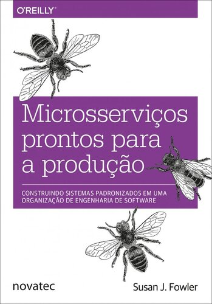

# Extras

## Monólito vs Microsservicos

**Hey!** Enquanto estava montando este curso, eu decidi remover uma aula teórica sobre este assunto! Porém eu decidi algo melhor, **recomendar um livro.**

O mesmo foi escrito pela Susan Fowler que é uma engenheira de confiabilidade da Uber Technologies.

Eu so fã deste livro e recomendo a todos, com certeza irá esclarecer você sobre este assunto e extrapola isso, é um excelente livro DevOps. O meu favorito.

**Boa leitura a todos.**

**Sucesso a todos vocês! E o meu muito obrigado novamente!**

> "Coragem - qualquer coisa capaz de iluminar deve resistir ao calor da luz."
>> Código de Um Cavaleiro
