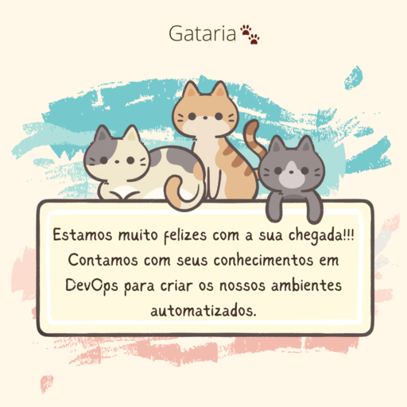
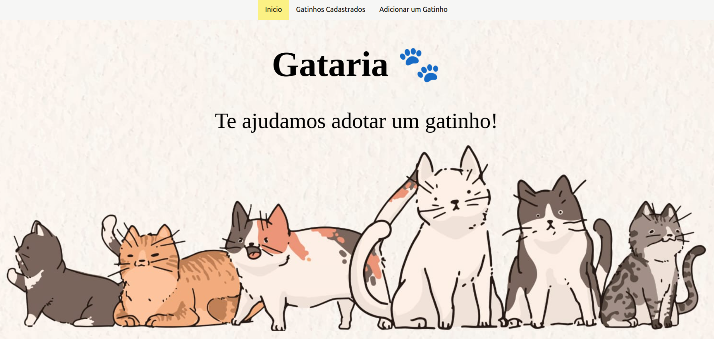
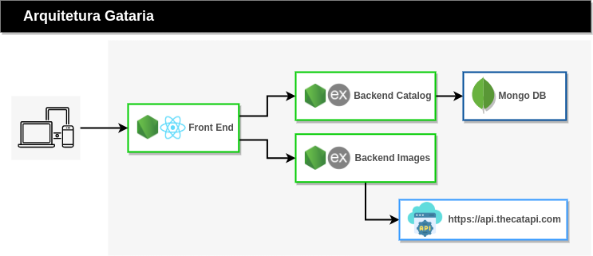
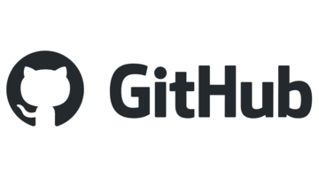

# Gataria Rede Social



A nossa **jornada** começa aqui no **1º primeiro dia de trabalho** na **Gataria** uma rede social para gatos.

## Navegando pela aplicação

Então vamos navegar pelo o que **ja foi desenvolvido** 🐾



Apos ver o código rodando e **conhecer o produto**, vamos entender agora a **arquitetura da aplicação.**

## Gataria Arquitetura



 

Com os conhecimento acimas, vamos finalmente **iniciar a nossa jornada devops prática.**
Nosso próximo passo vai ser **rodar a aplicação** na nossa maquina assim como os Devs estavam fazendo.

## Primeiras ferramentas necessárias

Começamos com uma instalação nova do **Ubuntu 22.04 Lts.**

Vamos instalar as **primeiras ferramentas**:

```
sudo apt update && sudo apt install -y terminator curl git vim zsh
```

- **terminator:** Um terminal Linux com capacidade de dividir a tela verticalmente ou horizontalmente podendo ter múltiplos terminais na mesma tela
- **curl**: Ferramenta via linha de comando para transferir dados usando protocolos, como o HTTP que utilizaremos.
- **git**: Sistema de controle de versão distribuído mais famoso do mundo. O Github utiliza ele.
- **vim**: Editor de texto via linha de comando.
- **zsh**: Um extensão para turbinar o seu terminal.

Precisamos [concluir](https://ohmyz.sh/#install) a instalação do zsh, e já podemos executar o comando pelo **Terminator**:

```
sh -c "$(curl -fsSL https://raw.githubusercontent.com/ohmyzsh/ohmyzsh/master/tools/install.sh)"
```

Antes de iniciar o código da Gataria, **precisaremos também:**
- [Google Chrome](https://www.google.com/intl/pt-BR/chrome/)
- [NodeJS](https://github.com/nodesource/distributions#using-ubuntu-2) 
- [VSCode](https://code.visualstudio.com/)

**Ambiente preparado**, vamos rodar o código da **Gataria**.

## Gataria Frontend

Iniciamos no **microsserviço** responsável pelo nosso **frontend**. O mesmo foi desenvolvido em **NodeJS** utilizando o framework **REACT**.

**Primeiro de tudo:** vamos ler o nosso **README.md**.


```npm install``` Baixar e instalar as **dependências** necessárias.

```npm start``` **Iniciar** a aplicação.

## Gataria Backend Catalog

Agora vamos iniciar o primeiro **microsserviço de backend: Catalog**. Responsável por todas as operações com o **MongoDB**.
O mesmo foi desenvolvido utilizando o framework **Express** do NodeJS. Começando como sempre lendo o **README.md**.


**Precisamos de um MongoDB!**


**Cadastrar uma conta** em [https://www.mongodb.com/cloud/atlas/register](https://www.mongodb.com/cloud/atlas/register)

Agora vamos [criar](https://account.mongodb.com/account/login) o nosso **Database**, e obter as credenciais de acesso.

Vamos setar as **variáveis de ambiente** e **iniciar** o código:


```npm install```

```npm start```


## Gataria Backend Images

Agora o nosso ultimo **microsserviço de backend: Images**. Responsável por fazer requisições para a api externa [The Cat API](https://thecatapi.com/).
O mesmo também foi desenvolvido com **Express** e nodejs. Então vamos ao **README.md**.


Vamos setar as **variáveis de ambiente** e **iniciar** o código:
 
```npm install```

```npm start```


**SUCESSO!!** Conseguimos rodar a **Gataria** com todos os seus **microsserviços** localmente assim como os **Devs** estavam executando.

E **antes** de colocar o código para rodar em **containers Docker**. Precisaremos de um **repositório git** para os nossos códigos.

## Github

**Nossa hospedagem de código.**



Criar uma [organização](https://github.com/settings/organizations) na plataforma para a **Gataria**, e criar os projetos para os **microsserviços**.


**Concluímos** a nossa primeira etapa: **CODE**!! Agora podemos ir para a proxima: **BUILD.**

**Nos vemos no próximo modulo.**