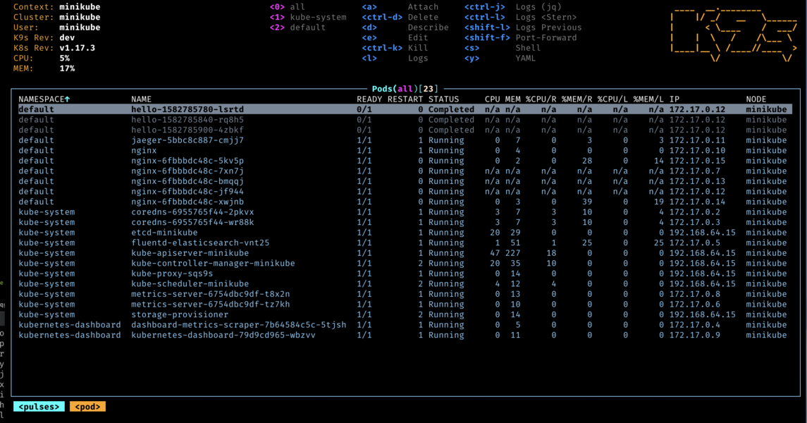

# Gataria via Kubernetes


Começamos o módulo com nossa **marcação** de aula teórica! Vamos a uma aula sobre **Kubernetes**.

 

Agora mãos na massa com **Kubernetes**.

## Instalando o Kubernetes

Vamos instalar nosso cluster **Kubernetes** via **kubeadm**, a partir das documentações oficiais abaixo:

- [Installing kubeadm](https://kubernetes.io/docs/setup/production-environment/tools/kubeadm/install-kubeadm/) 

- [Creating a cluster with kubeadm](https://kubernetes.io/docs/setup/production-environment/tools/kubeadm/create-cluster-kubeadm/) 


```
sudo apt-get update
sudo apt-get install -y apt-transport-https ca-certificates curl
curl -fsSL https://packages.cloud.google.com/apt/doc/apt-key.gpg | sudo gpg --dearmor -o /etc/apt/keyrings/kubernetes-archive-keyring.gpg
echo "deb [signed-by=/etc/apt/keyrings/kubernetes-archive-keyring.gpg] https://apt.kubernetes.io/ kubernetes-xenial main" | sudo tee /etc/apt/sources.list.d/kubernetes.list
sudo apt-get update
sudo apt-get install -y kubelet=1.25.11-00 kubeadm=1.25.11-00 kubectl=1.25.11-00
sudo apt-mark hold kubelet kubeadm kubectl
```

## Desativando a swap

O **Kubernetes** [não aceita swap](https://kubernetes.io/docs/setup/production-environment/tools/kubeadm/install-kubeadm/#before-you-begin)! Então vamos **desativar a swap** da nossa maquina:

```
sudo vim /etc/fstab
```

Comentar a linha `/swapfile`, **salvar e sair**. Reiniciar o sistema operacional, ou então digitar `sudo swapoff -a`

## Configurações runtime containerd

**Atualizando** o arquivo de configuração do **containerd**.

```
sudo containerd config default | sudo tee /etc/containerd/config.toml
```

Vamos procurar pela seguinte configuração: `SystemdCgroup` e **alterar o valor para true**. Sair e salvar o arquivo.

```
sudo vim /etc/containerd/config.toml
```

Reiniciar o **containerd** para efetuar o reload da **configuração**.

```
sudo systemctl restart containerd
```

## Iniciando o cluster

```
sudo kubeadm init
```

Conforme indicado no **resultado do comando** `kubeadm init`, vamos executar os comandos para configurar o cliente terminal **kubectl**

```
mkdir -p $HOME/.kube
sudo cp -i /etc/kubernetes/admin.conf $HOME/.kube/config
sudo chown $(id -u):$(id -g) $HOME/.kube/config
```

## Instalando o add-on network

Hà uma [lista](https://kubernetes.io/docs/concepts/cluster-administration/addons/#networking-and-network-policy) de plugins disponíveis para uso. Utilizaremos o **Weave Net**. Para **instalar execute:**

```
kubectl apply -f https://github.com/weaveworks/weave/releases/download/v2.8.1/weave-daemonset-k8s.yaml
```

## Taint no master

[Sujando nosso master](https://kubernetes.io/docs/setup/production-environment/tools/kubeadm/create-cluster-kubeadm/#control-plane-node-isolation)

```
kubectl taint nodes --all node-role.kubernetes.io/control-plane-
```

## Kubernetes pronto para receber a Gataria

```
kubectl get nodes
kubectl get all --all-namespaces
```

**SUCESSO!** Temos um **Kubernetes** para efetuar o **deploy da Gataria**.

## Namespaces: dividindo os ambientes no cluster

**Nosso primeiro arquivo .yml**

```
apiVersion: v1
kind: Namespace
metadata:
  name: prod
---
apiVersion: v1
kind: Namespace
metadata:
  name: dev
```

Começaremos pelo ambiente de Dev.

## Frontend via Kubernetes

Vamos precisar de um [Deployment](https://kubernetes.io/docs/concepts/workloads/controllers/deployment/#creating-a-deployment) e um [Service](https://kubernetes.io/docs/concepts/services-networking/service/#type-nodeport)


Nosso primeiro **microsserviço** já esta rodando no **Kubernetes**. Vamos para os **backends**.

## Backend Catalog via Kubernetes

Lembram das **variáveis de ambientes?**. No **Kubernetes** vamos utilizar 2 recursos agora que vão **gerenciar** as nossas [variáveis de ambiente](https://kubernetes.io/docs/tasks/inject-data-application/define-environment-variable-container/#define-an-environment-variable-for-a-container) para nossos deployments:

- [ConfigMap](https://kubernetes.io/pt-br/docs/concepts/configuration/configmap/)
- [Secret](https://kubernetes.io/docs/tasks/configmap-secret/managing-secret-using-config-file/)


Temos nosso primeiro **backend** rodando no **Kubernetes** e utilizando novos recursos: **ConfigMap e Secret.**

## Backend Images via Kubernetes

Já sabemos tudo que **precisamos** para subir o nosso ultimo **microsserviço**.


## Gataria rodando via Kubernetes

**Missão concluída!** A **Gataria** já está **rodando no Kubernetes**. Porém agora vamos aprender como **facilitar** nossa usabilidade do **Kubernetes**, utilizando o **Helm!**

Nossa proximo módulo já tem nome: **Gataria no Helm!**

## K9s

**Hey...!!!** antes do **Helm** que vai **facilitar** nossa vida. Vamos de mais uma ferramenta que tem **o mesmo objetivo** o:

- [k9s](https://k9scli.io/)

A melhor forma de instalar o **k9s** é pelo [brew](https://brew.sh/).

# Instalando o Brew

```
/bin/bash -c "$(curl -fsSL https://raw.githubusercontent.com/Homebrew/install/HEAD/install.sh)"
```

Execute os **comandos** para uma instalação completa do **brew**

```
(echo; echo 'eval "$(/home/linuxbrew/.linuxbrew/bin/brew shellenv)"') >> /home/$USERNAME/.zshrc
eval "$(/home/linuxbrew/.linuxbrew/bin/brew shellenv)"
sudo apt-get install -y build-essential
brew install gcc
```

**Agora só instalar o pacote k9s com o brew**

```
brew install k9s
```

Agora executamos no terminal: `k9s` e pronto.




**Uhuul** e que baita ferramenta **linda!!**

**Concluímos mais um módulo do Bootcamp!**

Vejo vocês no próximo: **Gataria via Helm.**