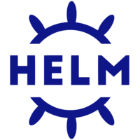
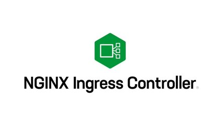

# Gataria via Helm



Perceberam uma **crescente** de arquivos **.yml?** Ainda faltam outros recursos como o **Ingress** e o **HPA**. Para todos eles precisaremos criar outros arquivos **.yml**. E se fosse possível **reunir** todos os **manifestos yml** necessários para cada **microsserviço**, de uma maneira instalável como um **gerenciador de pacotes.** 

É ai que o **Helm** poderá nos ajudar! E **não apenas isso!** Ele também será o responsável pelos nossos **deployments** e **rollbacks** de uma maneira **facilitada**, além de ter um **histórico e versões** dos nossos **deployments**.

## Instalando o Helm

Seguindo a **documentação oficial** vamos [instalar o Helm](https://helm.sh/docs/intro/install/#from-apt-debianubuntu).

```
curl https://baltocdn.com/helm/signing.asc | gpg --dearmor | sudo tee /usr/share/keyrings/helm.gpg > /dev/null
sudo apt-get install apt-transport-https --yes
echo "deb [arch=$(dpkg --print-architecture) signed-by=/usr/share/keyrings/helm.gpg] https://baltocdn.com/helm/stable/debian/ all main" | sudo tee /etc/apt/sources.list.d/helm-stable-debian.list
sudo apt-get update
sudo apt-get install -y helm
```

E na sequência vamos navegar pelos **Helm** [charts públicos.](https://artifacthub.io/packages/search?sort=relevance&page=1)

## Frontend via Helm Chart

Legal né? Agora vamos criar os nossos próprios **charts** para a **Gataria!**

Vamos começar pelo frontend. `helm create gataria-frontend`


Concluímos nosso primeiro **Helm chart!** Agora vamos construir os **charts** dos **backends**.

## Backend Catalog via Helm Chart

`helm create gataria-backend-catalog`


## Backend Images via Helm Chart

Vamos criar nosso ultimo **chart da Gataria!**


**Concluímos mais uma!** Estamos com a **Gataria** rodando apenas **via helm charts**.

## NGINX Ingress



- [Ingress](https://kubernetes.io/docs/concepts/services-networking/ingress/)

Atá aqui estamos usando as portas altas do **nodePort** `30000-32767`. Não seria mais interessante organizarmos tudo **via dns**? 

**Por exemplo,** nosso ambiente de **dev** vai responder pelo **endereço** `dev.gataria.example`.

E as nossas **apis backend** também vão responder pelo **mesmo endereço**. E pelas rotas da **url de requisição,** o trafego será roteado para o **backend correto:**

- `dev.gataria.example/catalog` -> **Requests direcionados ao Backend Catalog**
- `dev.gataria.example/images` -> **Requests direcionados ao Backend Images**

Assim, **não** vamos precisamos das portas altas do **nodePort** para **expor nossas aplicações.** Esse é o papel do **Ingress**, sera responsável por **balancear os requests para o serviços corretos,** conforme a configuração. Além de fazer **reload automático sempre que um novo registro for adicionado.**

Assim ficará fácil criar nosso **ambiente produtivo,** que terá o registro DNS como `gataria.example`

**Vamos ver isso na prática.**

## /etc/hosts - Nosso dns old school

**Hey!** Poderíamos utilizar um **DNS** free nesse curso? Até poderíamos, porém seria mais uma plataforma para cadastro.

Editar o nosso arquivo `/etc/hosts` **resolve nosso problema.** Pois teremos um **DNS**, igual algum **registrado, porém localmente**.! 

Vamos cadastrar os **endereços DNS da Gataria** e após podemos utilizar o **Kubernetes Ingress.**

```
sudo vim /etc/hosts
```

## Instalando Nginx Ingress

Lembram quando vimos os repositórios públicos de **charts Helm?** Vamos utilizar o primeiro. [Instalaremos](https://artifacthub.io/packages/helm/ingress-nginx/ingress-nginx) o **Ingress Nginx** via [chart oficial](https://artifacthub.io/packages/helm/ingress-nginx/ingress-nginx).

**Manter uma IaC atualizada** pode ser chato. Precisamos de um novo **Namespace**, e **voces lembram** do arquivo `namespaces.yml`? Vamos criar o novo **Namespace** por ele, assim **mantendo a infraestrutura como código atualizada.**

```
helm repo add ingress-nginx https://kubernetes.github.io/ingress-nginx
helm repo update
helm install ingress-nginx --namespace ingress-nginx --set rbac.create=true --set controller.kind=DaemonSet --set controller.service.type=ClusterIP --set controller.hostNetwork=true ingress-nginx/ingress-nginx
```

Na saída da instalação do **Ingress Nginx** pelo comando **Helm**, nos trouxe um exemplo de como usar o recurso **Ingress**. Então com ele em mãos, **vamos expor** algum dos nossos serviços para teste.

```
apiVersion: networking.k8s.io/v1
kind: Ingress
metadata:
  name: example
  namespace: foo
spec:
  ingressClassName: nginx
  rules:
    - host: www.example.com
      http:
        paths:
          - pathType: Prefix
            backend:
              service:
                name: exampleService
                port:
                  number: 80
            path: /
```

**Sucesso!** Ja vimos que somos capazes de colocar de **expor nossas aplicações via Ingress.** Então vamos fazer agora pelo nossos **Helm Charts.**

## Frontend via ingress

O Helm chart **já tem uma estrutura a nossa espera.** Vamos editar elas e ver se funciona?


**Sucesso!! Chart atualizado com o recurso ingress!**

## Backend Catalog via ingress

Atualizando nosso Helm Chart


## Backend Images via ingress

Atualizando nosso Helm Chart


**Mais uma missão concluída Gataria via Ingress!!**. **Gataria** totalmente funcional **apenas via DNS** `dev.gataria.example`. 

## Gataria via ClusterIP

As nossas **aplicações continuam expostas** via **nodePort**. Porém apos configurarmos o Ingress, vamos colocar agora nossas aplicações via **ClusterIP.**

Foi importante aprender o **nodePort**, pois ainda utilizaremos muito ele durante nosso curso.

**Então mãos a massa! E já vamos atualizar todos os charts de uma vez só.**


**Sucesso! Todos nossas aplicações agora via ClusterIP.**

**Estamos quase finalizando este módulo!** Precisaremos agora de um **repositório para os nossos charts.**

## Gataria via ChartMuseum

[ChartMuseum](https://chartmuseum.com/)

Você verificou quando instalamos o **Ingress Nginx via helm?** Não foi diretamente pelos arquivos e sim de um **repositório remoto.** E é isso que vamos fazer para os **charts da Gataria.**

Instalando **ChartMusseum** via [Helm chart official](https://artifacthub.io/packages/helm/chartmuseum/chartmuseum).

```
helm repo add chartmuseum https://chartmuseum.github.io/charts
helm repo update
helm install chartmuseum chartmuseum/chartmuseum -n github-actions --set service.type=NodePort --set service.nodePort=32200 --set env.open.DISABLE_API=false
```

Agora vamos subir os **Helm Charts da Gataria** para o **ChartMusseum.**

Precisaremos de um [plugin do helm](https://github.com/chartmuseum/helm-push#install).

```
helm plugin install https://github.com/chartmuseum/helm-push
```

Adicionando o nosso **ChartMusseum** aos repositórios do Helm.

```
helm repo add gataria-charts http://127.0.0.1:32200
```

Agora podemos efetuar **push** dos charts para o **ChartMusseum** 

```
helm cm-push . gataria-charts
```


Sucesso!! Vamos testar e instalar **todas as aplicações** pelo nosso repositório remoto **ChartMusseum.**

**Subimos toda a Gataria via Helm! Parabéns! Nosso módulo Helm acaba aqui!**

## HPA

- [HPA](https://kubernetes.io/docs/tasks/run-application/horizontal-pod-autoscale/)

Um recurso que todos estavam aguardando no **Kubernetes**: **escalar automaticamente as aplicações.**

Vamos configurar o recurso **HPA** para algum dos nossos microsserviços e após vamos ao próximo módulo. 

Primeiro **precisamos do metrics server!**

```
helm repo add metrics-server https://kubernetes-sigs.github.io/metrics-server/
helm repo update
helm install --namespace kube-system metrics-server metrics-server/metrics-server --set 'args={--kubelet-insecure-tls}'
```

## Nossos pods precisam de limites de CPU e RAM

O **HPA** precisa que nossos pods tenham limites computacionais configurados.

[Definindo resources limits](https://kubernetes.io/docs/concepts/configuration/manage-resources-containers/)

```
resources:
  limits:
    cpu: 100m
    memory: 128Mi
  requests:
    cpu: 100m
    memory: 128Mi

```


Após atualizar um dos nossos charts, vamos testar o **HPA**.

Vamos testar o **auto scale** de uma maneira não legal!! Ao final do curso mostraremos como testar o **auto scale** de uma maneira legal, aguentem firmes:

```
kubectl run -i --tty load-generator --image=busybox /bin/sh -n dev

while true; do wget -q -O- http://gataria-backend-catalog/catalog/healthcheck; done
```

**Vimos nossa aplicação escalando e desescalando de maneira automática. Muito legal!**

Agora podemos dar este **módulo como concluído!!** Na sequência embarcamos na nossa jornada **CI/CD!** 

Chegou o momento de construir nossas **Pipelines CI/CD. Vamos ao proximo módulo!**