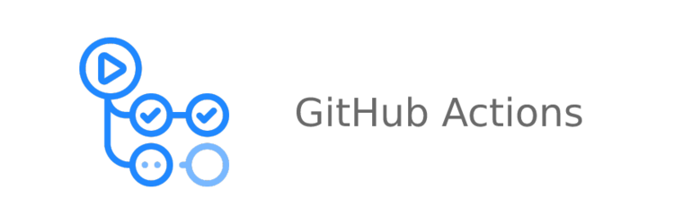
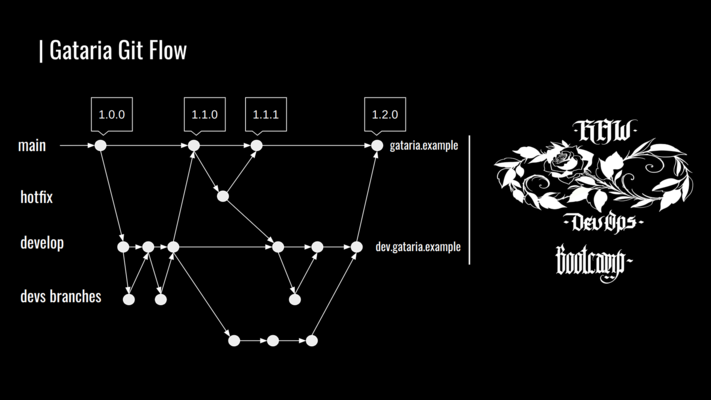
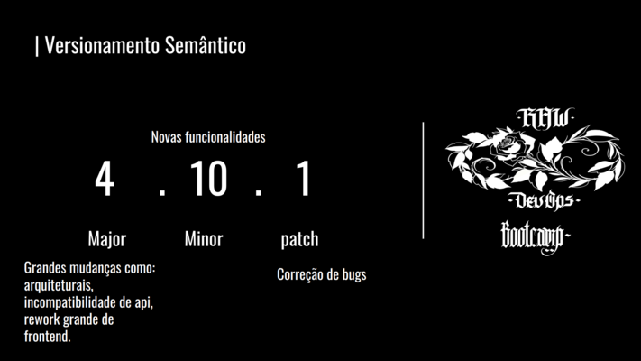
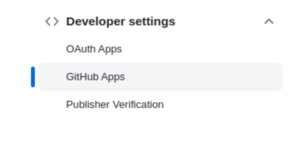
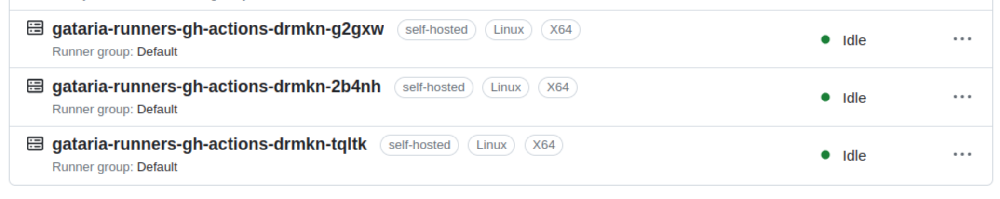
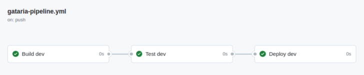
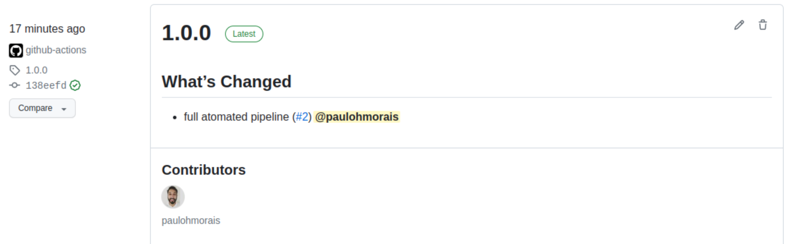

# Gataria via Github Actions



> **O Github Actions é uma plataforma de CI/CD, que permite automatizar fluxos de trabalho computacional, como os passos de Build, Test, Deploy. Após definir alguma trigger que pode ser um commit, um pull request, até mesmo manualmente. Que inicia um container temporário(ou runner), que irá executar automaticamente a receita de commandos definida pela pipeline. E que extrapola o Build -> Test -> Deploy. Podemos por exemplo apenas rodar algum script python, as possibilidades absolutamente são sem fim.**

## Runners públicos vs Self-hosted

Para repositórios privados temos uma limitação de [2.000 minutos grátis por mês](https://github.com/features/actions) para o uso dos runners publico do github. 

Porém podemos usar os **runners tipo** [self-hosted](https://docs.github.com/en/actions/hosting-your-own-runners/managing-self-hosted-runners/about-self-hosted-runners) dentro do nosso cluster **Kubernetes**. **Assim não teremos limites de uso**, pois todo o **processamento** sera executado **dentro do nosso cluster.**

**Mas antes de escrevermos nosso primeiro pipeline**, precisamos entender 2 conceitos: Git Flow e Versionamento Semântico.

## Git Flow

- [Gitflow](https://nvie.com/posts/a-successful-git-branching-model/)




## Versionamento Semântico

- [Versionamento Semântico](https://semver.org/lang/pt-BR/)




## Instalando runners do Github Actions no Cluster Kubernetes

[Actions Runner Controller](https://github.com/actions/actions-runner-controller) - Kubernetes controller for GitHub Actions self-hosted runners

Primeiro [precisamos](https://github.com/actions/actions-runner-controller/blob/master/docs/quickstart.md#prerequisites) do **cert-manager** e vamos instalar [pelo helm](https://cert-manager.io/docs/installation/helm/#4-install-cert-manager).

```
helm repo add jetstack https://charts.jetstack.io
helm repo update

helm install cert-manager jetstack/cert-manager \
  --namespace cert-manager \
  --version v1.11.1 \
  --set installCRDs=true
```

Com o cert-manager running, vamos ao próximo passo.

Precisamos que o actions runner controller **autentique com a Github API.**

E para isso **vamos ao Github** [criar uma app](https://github.com/actions/actions-runner-controller/blob/master/docs/authenticating-to-the-github-api.md) na nossa **organização**. E após obter as 3 informações seguintes: `github_app_id`, `github_app_installation_id`, `github_app_private_key`.



Agora criar uma nova [secret Kubernetes](https://github.com/actions/actions-runner-controller/blob/master/docs/authenticating-to-the-github-api.md#setting-up-authentication-with-github-api) com os dados.

```
kubectl create secret generic controller-manager \
    -n github-actions \
    --from-literal=github_app_id=${APP_ID} \
    --from-literal=github_app_installation_id=${INSTALLATION_ID} \
    --from-file=github_app_private_key=${PRIVATE_KEY_FILE_PATH}
```

Hey? **Melhor fazer via IaC?** `echo -n 'value' | base64`


Finalmente agora tudo certo! **Vamos instalar** o [actions runners controller](https://github.com/actions/actions-runner-controller/blob/master/docs/installing-arc.md#installation) no **Kubernetes** via [helm](https://github.com/actions/actions-runner-controller/blob/master/charts/actions-runner-controller/README.md)

```
helm repo add actions-runner-controller https://actions-runner-controller.github.io/actions-runner-controller
helm repo update

helm install --namespace github-actions actions-runner-controller actions-runner-controller/actions-runner-controller
```

Agora podemos subir os **runners no Kubernetes**, e que será a nível de [organização](https://github.com/actions/actions-runner-controller/blob/master/docs/choosing-runner-destination.md#adding-runners-to-an-organization) no Github. Pois desta forma os **runners** podem ser utilizados por qualquer projeto dentro da organização.

```
apiVersion: actions.summerwind.dev/v1alpha1
kind: RunnerDeployment
metadata:
  name: gataria-runners-gh-actions
  namespace: github-actions
spec:
  replicas: 2
  template:
    spec:
      organization: your-organization-name
```

Voltamos ao **Github** e vamos verificar se a plataforma reconheceu os novos **runners tipo self-hosted**.



**Sucesso!!!** Runners configurados, agora vamos escrever as nossas pipelines.

## Nossa primeira pipeline

Vamos iniciar a nossa estratégia de **Git Flow**, criar uma **nova branch** `git checkout -b dev` e vamos iniciar nosso **pipeline** pelo **ambiente de dev**.

Tudo que estiver dentro da pasta `.github/workflows/` será reconhecido pelo Github Actions.

Assim vamos criar o arquivo **gataria-pipeline-dev.yml** no projeto: `.github/workflows/gataria-pipeline.yml`

- **Build -> Test -> Deploy**

Começaremos montarmos as bases do nosso **pipeline**, vamos entender o que são **jobs**, executar alguns [comandos](https://docs.github.com/en/actions/learn-github-actions/essential-features-of-github-actions) pelo runners e entender o que são [github context](https://docs.github.com/en/actions/learn-github-actions/contexts#github-context).

```
---
name: Gataria CI/CD Dev
on:
  push:
    branches:
      - dev

jobs:
  build-dev:
    name: Build dev
    if: contains (github.ref, 'dev')
    runs-on: self-hosted
    steps:
    - name: Clone repository
      uses: actions/checkout@v3
    - name: Step 2
      run: ls
    - name: run command
      run: docker ps
  test-dev:
    name: Test dev
    if: contains (github.ref, 'dev')
    runs-on: self-hosted
    needs: build-dev
    steps:
    - name: Step 1
      run: env
  deploy-dev:
    name: Deploy dev
    if: contains (github.ref, 'dev')
    runs-on: self-hosted
    needs: test-dev
    steps:
    - name: run command
      run: echo $GITHUB_SHA
```

**Primeiro pipeline rodando!!** 



## Frontend Pipeline dev

Vamos construir as **pipelines** da **Gataria**. Basicamente vamos **automatizar tudo que fizemos ate aqui.**


Teste step [referencia](https://docs.github.com/en/actions/automating-builds-and-tests/building-and-testing-nodejs#example-using-npm).

Para o **step de Deploy** vamos precisar uma imagem Docker com o **kubectl**, **helm** e o nosso **kubeconfig**.

```
FROM ubuntu:22.04
COPY config /usr/src/app/
WORKDIR /usr/src/app
RUN apt update && apt install curl -y
RUN curl -LO "https://storage.googleapis.com/kubernetes-release/release/$(curl -s https://storage.googleapis.com/kubernetes-release/release/stable.txt)/bin/linux/amd64/kubectl" \
    && chmod +x ./kubectl \
    && mv ./kubectl /usr/local/bin/kubectl \
    && curl -fsSL -o get_helm.sh https://raw.githubusercontent.com/helm/helm/main/scripts/get-helm-3 \
    && chmod +x get_helm.sh && ./get_helm.sh
ENV KUBECONFIG=/usr/src/app/config
```

Entenderemos na pratica o que é registry de imagens de containers público vs privado.

**E Sucesso!! Do build ao deploy ambiente de dev automatizado!** Agora precisamos da pipeline do **ambiente produção!** 

## Frontend Pipeline Prod

Chegamos então ao **pipeline do ambiente de prod!**

Vamos adicionar o recurso **HPA** e **definir limites para os nossos pods** no **Helm Chart** e lembrar de subir o chart pro **ChartMusseum**.


HPA [referencia](https://kubernetes.io/docs/tasks/run-application/horizontal-pod-autoscale-walkthrough/#autoscaling-on-multiple-metrics-and-custom-metrics).

## Gataria 1.0.0 - Precisamos da Estrategia SemVer 

**Release -> Build -> Test -> Deploy**

O novo step de **Release** da pipeline de prod, deverá:

- **Automatizar o versionamento semântico sempre alguma nova release for publicada**
- **Trackear Issues e Pull Requests que subiram nesta nova versão**

Vamos conhecer o [Release Drafter](https://github.com/marketplace/actions/release-drafter) pela [Markeplace](https://github.com/marketplace/actions/release-drafter) do **Github Actions**.


`.github/workflows/release-drafter.yml`

```
name: Release Drafter

on:
  pull_request:
    types: [closed]

permissions:
  contents: read

jobs:
  update_release_draft:
    permissions:
      contents: write
      pull-requests: write
    runs-on: ubuntu-latest
    steps:
      - uses: release-drafter/release-drafter@v5
        env:
          GITHUB_TOKEN: ${{ secrets.GITHUB_TOKEN }}
```

`.github/release-drafter.yml`

```
name-template: '$RESOLVED_VERSION'
tag-template: '$RESOLVED_VERSION'
version-resolver:
  major:
    labels:
      - 'major'
  minor:
    labels:
      - 'minor'
  patch:
    labels:
      - 'patch'
  default: patch
template: |
  ## What’s Changed

  $CHANGES
```

Agora vamos configurar para que a **pipeline de produção** se inicie apenas quando uma **release for publicada manualmente**.


`${GITHUB_REF##*/}` [Processando](https://docs.github.com/en/actions/using-workflows/events-that-trigger-workflows#release) nossa versão de prod.



**Sucesso!!** Pipelines dev e prod funcionando.

**Que caminhada ate aqui não?** Agora até podemos sentir que estamos acabando a nossa jornada.

Agora precisamos **replicar** o processo para os outros 2 **microsserviços**.

## Backend Catalog CI/CD

**Atualizar o Helm chart e criar as pipelines do Github Actions.**

HPA [referencia](https://kubernetes.io/docs/tasks/run-application/horizontal-pod-autoscale-walkthrough/#autoscaling-on-multiple-metrics-and-custom-metrics).


## Backend Images CI/CD

**Atualizar o Helm chart e criar as pipelines do Github Actions.**


## SUCESSO! PARABÉNS!!! MISSÃO CUMPRIDA!

**Todos os ambientes para os microsserviços da Gataria foram devidamente criados e automatizados!**

Acredito que agora vamos iniciar praticamente **uma nova jornada** que é a parte de **monitoramento para a Gataria**.

Então a gente se vê no nosso **último modulo!**