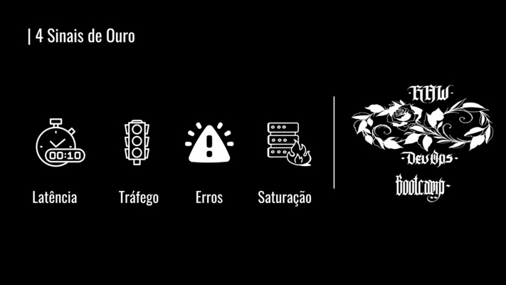
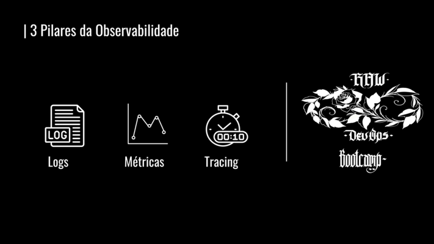

# Gataria Monitoramento


Vamos implementar um **stack completa** de **monitoramento e observabilidade** para a **Gataria**, incluindo até mesmo um **APM (Application Performance Monitoring).**

Antes de iniciar a parte prática vamos ter 2 marcações #GatariaAulaTeórica

## 4 Sinais de ouro




## 3 Pilares da Observavilidade





## Stack: Prometheus, Loki e Grafana via Helm

Agora temos um norte a seguir! Vamos a parte **prática**

**Vamos subir a stack pelo Helm**

[Prometheus + Grafana](https://artifacthub.io/packages/helm/prometheus-community/kube-prometheus-stack)

[Loki](https://artifacthub.io/packages/helm/grafana/loki-stack)

```
helm repo add prometheus-community https://prometheus-community.github.io/helm-charts
helm repo update
helm install prometheus prometheus-community/kube-prometheus-stack -n monitoring  --set grafana.service.type=NodePort --set prometheus.service.type=NodePort

helm repo add grafana https://grafana.github.io/helm-charts
helm repo update 
helm install loki grafana/loki-stack -n monitoring
```

**O Helm é incrível** não é?

```
Username: admin

Password: prom-operator
```

`http://loki:3100/`

Dashboard Loki [13639](https://grafana.com/grafana/dashboards/13639-logs-app/)

Agora precisamos de coletar **Tracings**

## Afinal o que e um APM?


## SigNoz APM

**Install Longhorn**

```
sudo apt install open-iscsi
helm repo add longhorn https://charts.longhorn.io
helm repo update
helm install longhorn longhorn/longhorn --namespace longhorn-system
```

**Vamos instalar o [SigNoz](https://signoz.io/docs/install/kubernetes/others/) via Helm**

```
helm repo add signoz https://charts.signoz.io
helm repo update
helm install signoz signoz/signoz -n monitoring --set otelCollector.service.type=NodePort --set frontend.service.type=NodePort
```

## Instrumentando as Apps da Gataria com OpenTelemetry

Instalando os pacotes do **OpenTelemetry** via [Auto Instrumentação](https://signoz.io/docs/instrumentation/express/)

```
npm install --save @opentelemetry/sdk-node
npm install --save @opentelemetry/auto-instrumentations-node
npm install --save @opentelemetry/exporter-trace-otlp-http
```

Criar o arquivo chamado: `tracing.cjs`

E precisaremos retirar as **configurações** do código e passar para o ambiente. Para instrumentar **prod e dev.**

```
  // tracing.js
  'use strict'
  const process = require('process');
  const opentelemetry = require('@opentelemetry/sdk-node');
  const { getNodeAutoInstrumentations } = require('@opentelemetry/auto-instrumentations-node');
  const { OTLPTraceExporter } = require('@opentelemetry/exporter-trace-otlp-http');
  const { Resource } = require('@opentelemetry/resources');
  const { SemanticResourceAttributes } = require('@opentelemetry/semantic-conventions');
  
  const exporterOptions = {
    url: 'http://localhost:4318/v1/traces'
  }
  
  const traceExporter = new OTLPTraceExporter(exporterOptions);
  const sdk = new opentelemetry.NodeSDK({
    traceExporter,
    instrumentations: [getNodeAutoInstrumentations()],
    resource: new Resource({
      [SemanticResourceAttributes.SERVICE_NAME]: 'node_app'
    })
    });
    
    // initialize the SDK and register with the OpenTelemetry API
    // this enables the API to record telemetry
    sdk.start()
    
    // gracefully shut down the SDK on process exit
    process.on('SIGTERM', () => {
      sdk.shutdown()
      .then(() => console.log('Tracing terminated'))
      .catch((error) => console.log('Error terminating tracing', error))
      .finally(() => process.exit(0));
      });
```

```
    "start": "node -r ./tracing.cjs api.js",
```

**Gataria agora tem um monitoramento completo!**

## Coletando métricas do Kubernetes com Open Telemetry

**O Open Telemetry é capaz de coletar Logs, Tracings, Métricas!** Vamos dar uma olhada em como coletar [métricas do k8s](https://signoz.io/docs/tutorial/kubernetes-infra-metrics/), assim com o Prometheus faz.

```
helm install my-release signoz/k8s-infra -n monitoring  \
  --set otelCollectorEndpoint=<IP-or-Endpoint-of-SigNoz-OtelCollector>:4317
```

Dashboards: [1](https://raw.githubusercontent.com/SigNoz/dashboards/main/k8s-infra-metrics/cpu-memory-metrics.json),[2](https://raw.githubusercontent.com/SigNoz/dashboards/main/k8s-infra-metrics/kubernetes-metrics.json),[3](https://raw.githubusercontent.com/SigNoz/dashboards/main/hostmetrics/hostmetrics-k8s.json
)
## Atual estado do monitoramento DevOps Open Source

A proposta do **Signoz** de ser uma **plataforma única**, e com apenas 1 exporter é íncrivel!

[Open Telemetry](https://opentelemetry.io/)

## Aulas finais: k6 e Docusaurus

**Instalando o [k6](https://k6.io/docs/get-started/installation/#debian-ubuntu)**

```
sudo gpg -k
sudo gpg --no-default-keyring --keyring /usr/share/keyrings/k6-archive-keyring.gpg --keyserver hkp://keyserver.ubuntu.com:80 --recv-keys C5AD17C747E3415A3642D57D77C6C491D6AC1D69
echo "deb [signed-by=/usr/share/keyrings/k6-archive-keyring.gpg] https://dl.k6.io/deb stable main" | sudo tee /etc/apt/sources.list.d/k6.list
sudo apt-get update
sudo apt-get install k6
```

Criar o arquivo `k6.js`

```
import http from 'k6/http';

export default function () {
  http.get('http://test.k6.io');
}
```
Agora vamos [executar](https://k6.io/docs/using-k6/http-requests/) o teste de carga

```
k6 run --vus 10 --duration 600s k6.js
```

**Todo time bom tem uma documentação técnica boa!** 

Assim apresentamos a **nossa solução de documentação favorita** o [Docusarus](https://docusaurus.io/)

> Inclusive esse site e essa documentação foi desenvolvida em cima dele ❤️

## OBRIGADO PESSOAL!

Nossa aula final chegou, e **BRAVOOO** por terem chegado até aqui! Desejo muito sucesso a todos vocês.

❤️