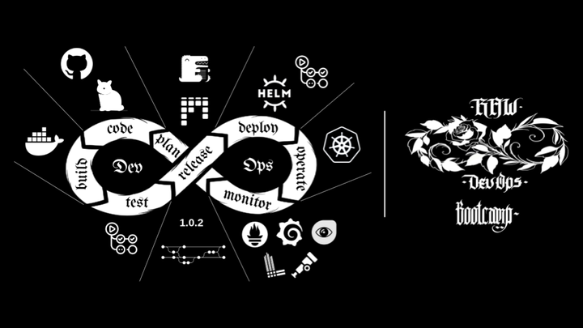

# RAW DevOps Bootcamp

Curso completo no estilo hands on sobre DevOps!

## Nosso diferencial

**O roadmap em DevOps é muito extenso!** Além de ser necessário aprender utilizar **varias ferramentas, ainda são muitas as opções.** Normalmente estudamos separadamente cada uma e as vezes ficamos sem um contexto que conecte elas.

Assim o principal diferencial deste Curso é o **contexto** do mesmo, partindo **do código ao deploy.** Uma abordagem de **aprendizado** mais próxima a realidade.

**Somos um curso estilo Bootcamp!!!** Então **preparem-se!** Será mãos da massa o tempo todo do início ao fim, **ate construirmos tudo!!!**

## Qual o nível do curso?

O curso tem **nível intermediário** e abordaremos alguns assuntos avançados como por exemplo APM.

**Focaremos no que importa** para construir o ambiente DevOps e não haverá aulas sobre algumas coisas mais simples como por exemplo: como criar uma conta no Github.

## Para quem é este curso

- Quem ainda esta preenchendo o seu roadmap DevOps, e queira turbinar esse aprendizado. 
- Profissionais de infraestrutura que desejam aprender/migrar para DevOps e/ou aprimorar suas habilidades técnicas com novas ferramentas
- Quem já estudou a teoria DevOps e agora deseja vivenciar uma abordagem prática
- Desenvolvedores interessados no assunto, incrementando o currículo com conhecimentos em DevOps
- Desenvolvedores que desejam migrar para DevOps
- Profissionais como Product Owner (PO), Product Manager(PM), entre outros cargos gerenciais em volta de metologias ágeis. Que desejam ver de maneira
mais prática e técnica um ciclo DevOps operando.

## Requisitos

- Ubuntu 22.04 ou superior
- Linux
- 8GB RAM
- Disco SSD seria interessante
- Cadastro em algumas plataformas como Github, Docker Hub
- Esta documentação é essencial! E será a nossa companheira até o final do curso

## Marcações

Mãos a massa! Esta marcação indica a construção da Infraestrutura como Código da Gataria.

Indica uma aula teórica