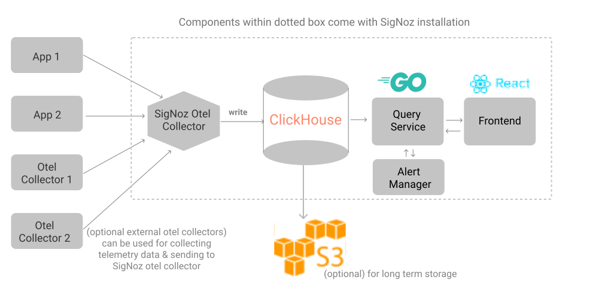

# SigNoz introdução e instalação

## OpenTelemetry Introdução

## Arquitetura SigNoz



## SigNoz Install with Docker

Se não tiver o docker instalado, podemos rodar `curl -fsSL https://get.docker.com | bash`

Para instalar o SigNoz:

1. Clonar o repo, e acessar a pasta `/deploy` do repo 

```
git clone -b main https://github.com/SigNoz/signoz.git && cd signoz/deploy/

```
2. Rodar o script de instalação
   
```
./install.sh
```

Portas:

- 3301 - SigNoz frontend port
- 4317 - Otel Collector gRPC port
- 4318 - Otel Collector HTTP port

Vamos acessar o SigNoz `http://localhost:3301/` ou então usando o ip do servidor signoz exemplo: `http://192.168.1.100:3301/`

## SigNoz Install with Kubernetes