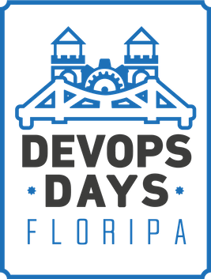

**A RAW DevOps vai levar um dos nossos alunos para o DevOpsDays Florianópolis 2023 que vai acontecer dia 11/11/2023!**

Já pensou ir em um dos eventos DevOpsDays com tudo pago?

Vamos dar essa oportunidade incrível para um dos nossos alunos e ajuda-los em suas carreiras. Eventos como este vão te trazer para o que há de mais moderno na área com experiências reais compartilhadas de palestrantes das maiores empresas do país. Uma experiencia que pode mudar sua carreira e também agregar muito ao currículo.

E não menos importante ainda visitar Florianópolis \o/

Florianópolis é conhecida por ser a "Ilha da Magia", por suas belas praias e seus pontos turísticos, e também por ser a "Ilha do Silício" esse polo cada vez mais em expansão em tecnologia que está cada vez mais atraindo os olhos do mundo.

E o DevOpsDays é uma série de conferências mundial onde os temas são desenvolvimento de software, operação da infraestrutura de TI e a intersecção entre eles. 

Uma oportunidade incrível de network e aprendizado.

E você sabia que o nosso instrutor será um dos palestrantes? Este é um dos motivos que estamos fazendo esta promoção.

Mais informações sobre o evento no link: [**DevOpsDays Florianópolis**](https://devopsdays.org/events/2023-florianopolis/welcome/)

Leia atentamente as informações abaixo e caso ainda persista alguma dúvida nos envie um email para: **rawdevops@gmail.com**

## O que está incluso?

- Passagens aéreas ida e volta para Florianópolis partindo do aeroporto com voo comercial + próximo ao ganhador
- Voo de ida: 10/11/2023 e Voo de volta: 12/11/2023
- 2 dias de hospedagem em Hotel próximo ao evento
- 1 corrida Uber do aeroporto de Florianópolis até o Hotel
- 1 corrida Uber do Hotel ate o local do evento
- 1 corrida Uber do local do evento ate o Hotel
- 1 corrida Uber do Hotel ate o aeroporto
- Não arcaremos com o translado da sua residência até o aeroporto, nem ao retorno do evento o translado do aeroporto ate a sua residência
- 2 dias de ajuda de custo no valor de R$ 110,00 por dia
- Carona para a praia mole com o instrutor se quiser :D

## Regras

- Ter + de 18 anos
- Estar disponível para viajar dia 10/11 e retornar dia 12/11, os voos podem partir de qualquer horário nos dias citados, conforme disponibilidade de voos de cada aeroporto
- Ter comprado nosso curso utilizando cupom de desconto (Ex: RAWDEVOPSFLN, RAWDEVOPS)

## Como vai funcionar?

- Apenas 200 vagas disponíveis para o sorteio com 1 ganhador
- **Sorteio no próximo sorteio da loteria federal assim que os números forem preenchidos, que ocorrem as quartas e sábado ou dia 11/10/2023**
- Após a compra do curso e se você esta dentro dos requisitos das regras, preencher o form da promoção: [**https://forms.gle/KBeB9ZyicTgDqisK9**](https://forms.gle/KBeB9ZyicTgDqisK9)
- Escolher 5 números disponíveis na planilha: [**https://docs.google.com/spreadsheets/d/1JWW38WaJCuJQttom7q4pU42zrwdjMOBg7btWCr8gpx0/edit?usp=sharing**](https://docs.google.com/spreadsheets/d/1JWW38WaJCuJQttom7q4pU42zrwdjMOBg7btWCr8gpx0/edit?usp=sharing)
- Após o preenchimento do form, o mais breve possível ou em até 1 dia útil, entraremos em contato para a coleta dos números escolhidos, reservar e confirmar os mesmos.
- Aguardar a reserva e confirmação dos números escolhidos
- Apos confirmação dos números escolhidos te adicionaremos a um grupo de Whatsapp com todos os 200 participantes, onde vocês serão atualizados sobre o andamento da promoção e o preenchimento das vagas.
- Assim que preencher os 200 números vamos fazer uma live para o sorteio no proximo sorteio da loteria federal ou então no dia 11/10/2023 caso não se preencha todos os números
- O número sorteado será os 3 últimos números do primeiro sorteio/destino do sorteio realizado pela loteria federal
- Aos participantes vamos sempre mantê-los atualizados no grupo de Whatsapp e desejo boa sorte a todos.

