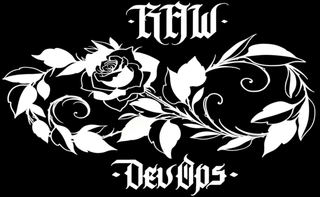

A **RAW DevOps** é uma empresa especializada em consultoria e treinamentos em Infraestrutura Moderna de TI, com uma abordagem diferenciada que se baseia em três ideais centrais:

- **Home Office:** Nosso modelo de trabalho é inspirado por empresas pioneiras como GitLab, que adotou o trabalho remoto desde o início, em 2011, e hoje é uma empresa de código aberto com capital aberto na bolsa de valores dos Estados Unidos. Além disso, buscamos referência na Cannonical, que oferece oportunidades remotas para seus colaboradores desde 2004. Acreditamos no potencial do home office para proporcionar flexibilidade e produtividade à equipe.

- **Open Source:** Valorizamos a filosofia do software de código aberto e estamos comprometidos com o uso de Softwares Open Source em todos os nossos projetos. Acreditamos que essa abordagem não apenas proporciona alta qualidade, mas também cria uma comunidade colaborativa em torno das tecnologias utilizadas, beneficiando a todos os envolvidos.

- **Infraestrutura Moderna:** Defendemos a construção de uma infraestrutura moderna, ágil e escalável. Para isso, adotamos tecnologias de nuvem como Google Cloud e AWS, que permitem a implantação rápida e elástica de recursos de computação, armazenamento e rede conforme a demanda. Essa abordagem possibilita que nossa equipe de DevOps se adapte rapidamente às necessidades do negócio, escale recursos de acordo com o crescimento da demanda e promova a entrega contínua de software com maior confiabilidade. Além disso, a infraestrutura moderna contribui para um ambiente de trabalho menos estressante para os profissionais de TI, ao otimizar processos e garantir maior eficiência.
Nosso compromisso com esses ideais nos permite oferecer soluções inovadoras e de alta qualidade aos nossos clientes, auxiliando-os a alcançar seus objetivos de forma eficiente e sustentável no ambiente de TI moderno. Seja em projetos de consultoria ou treinamentos, estamos dedicados a impulsionar o sucesso de nossos clientes por meio de nossa expertise em Infraestrutura Moderna de TI.